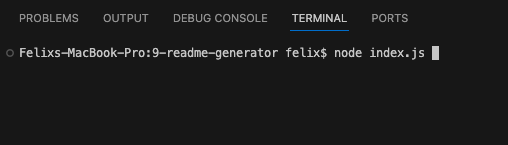
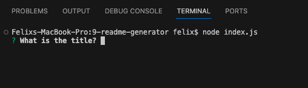
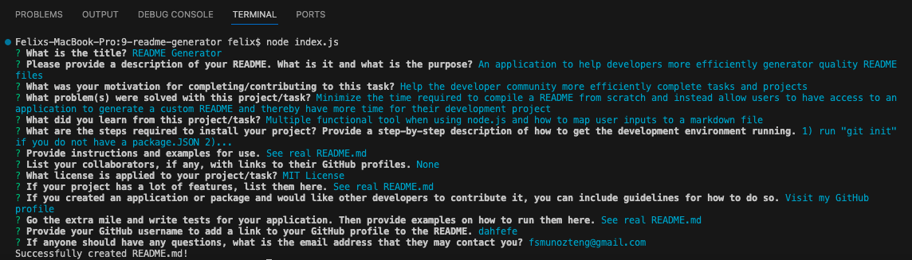
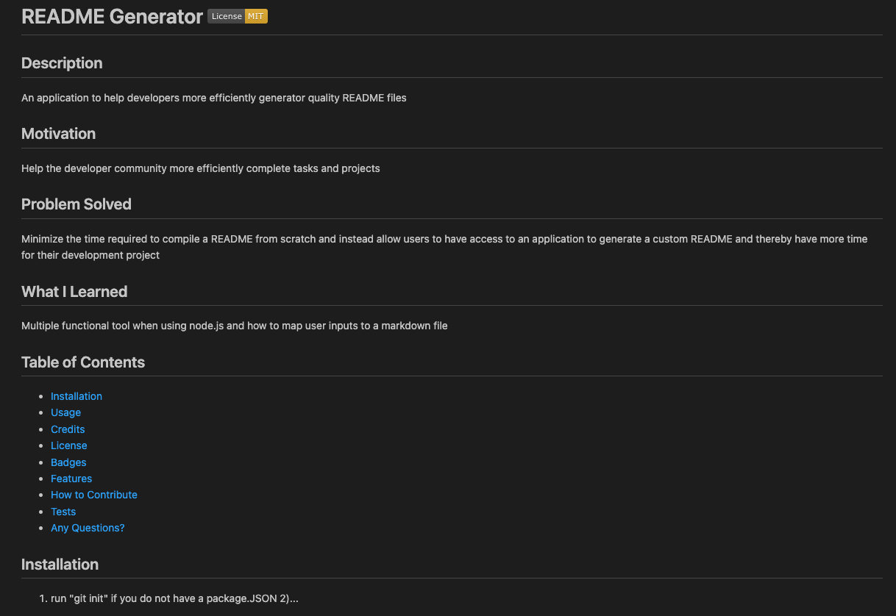
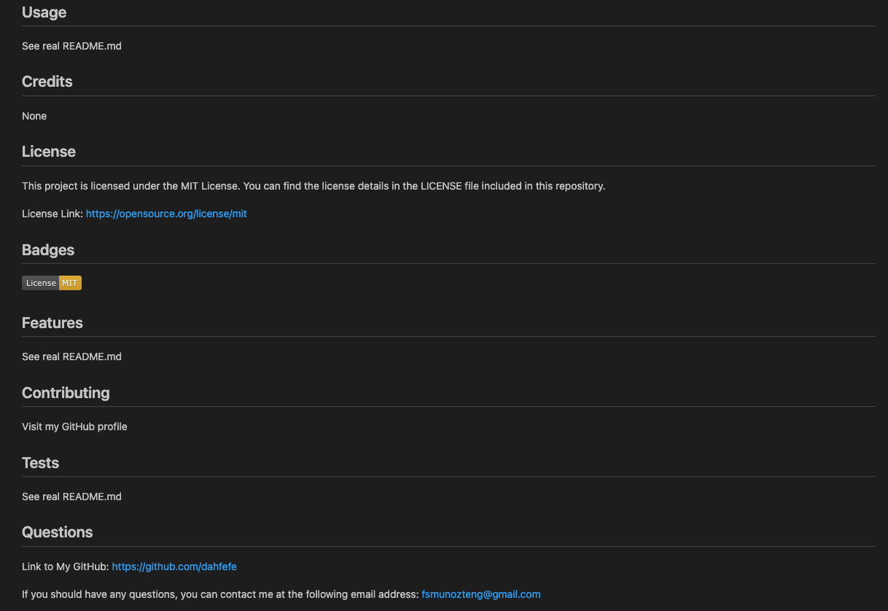

# 09 README.md Generator  [](https://opensource.org/licenses/MIT)

## User Story

```md
AS A developer
I WANT a README generator
SO THAT I can quickly create a professional README for a new project
```

## Description

This README.md generator application allows users to generate custom, high-quality README files using command-line application to collect necessary information through prompts.

This will allow project creators to dedicate more time to the primary project and minimize time needed for the ancillary components (i.e. README files).

The application will be invoked by using the following command:

```bash
node index.js
```

GitHub repo link: https://github.com/dahfefe/9-readme-generator

## Motivation
  
To enable the developer community to minimize time required for creation of README content and spend more time on their primary task. 

## Problem Solved
  
Developers and project creators can more efficiently utilize their time for the primary task of development in their projects and minimize more repetitive tasks that are directly involved in the developing process (i.e. the README.md file).

## What I Learned
  
I became better familiarized with node.js in relation to Inquirer package for utilizing command-line prompts. Additionally, I gained a better understanding of utilizing node.js functionality to apply user inputs to markdown files like README.md. 

## Table of Contents

- [Installation](#installation)
- [Usage](#usage)
- [Credits](#credits)
- [License](#license)
- [Features](#features)
- [How to Contribute](#contributing)
- [Tests](#tests)
- [Any Questions?](#questions)

## Installation 
  
1) Visit my GitHub repo for required code: https://github.com/dahfefe/9-readme-generator
2) Using SSH key from the repository, clone down the repo to your desired directory. 
3) Open the cloned repository using your code editor of choice. 
4) Ensure there is a `.gitignore` file that includes `node_modules/` and `.DS_Store/` so that your `node_modules` directory isn't tracked or uploaded to GitHub, in the event you wish to fork this repository. Be sure to create your `.gitignore` file before installing any npm dependencies.
5) Make sure that your repo includes a `package.json` with the required dependencies. You can create one by running `npm init` when you first set up the project, before installing any dependencies.
6) Run "npm install inquirer@8.2.4" in the terminal to install the required Inquirer package at the proper version. 

## Usage

The main case use for this project include the following:
1) To custom generate a README.md file based on command-line user inputs

## Screenshot of Application

When initially starting the application, open the terminal and run "node index.js":



When the command is ran, user will be directed by command-line prompts:



Once the user has answered all prompts, the terminal input should appear like the following:



A README.md file will generate and appear like the following example (page 1):



A README.md file will generate and appear like the following example (page 2):



## Credits

[Professional README Guide](https://coding-boot-camp.github.io/full-stack/github/professional-readme-guide) 

[Inquirer package](https://www.npmjs.com/package/inquirer/v/8.2.4)

[Markdown Badges for Licenses](https://gist.github.com/lukas-h/2a5d00690736b4c3a7ba)

## License [](https://opensource.org/licenses/MIT)

This project is licensed under the [MIT License](https://opensource.org/license/mit). You can find the license details in the LICENSE file included in this repository.

## Features
  
Dependency: [Inquirer package](https://www.npmjs.com/package/inquirer/v/8.2.4)

## Contributing

There are many ways in which you can participate in this project, for example:

* [Submit bugs and feature requests](https://github.com/dahfefe/9-readme-generator/issues), and help us verify as they are checked in
* Review [source code changes](https://github.com/dahfefe/9-readme-generator/pulls)
* Review the [documentation](https://github.com/microsoft/vscode-docs) and make pull requests for anything from typos to additional and new content

## Questions
  
Link to My GitHub: https://github.com/dahfefe

If you should have any questions, you can contact me at the following email address: fsmunozteng@gmail.com